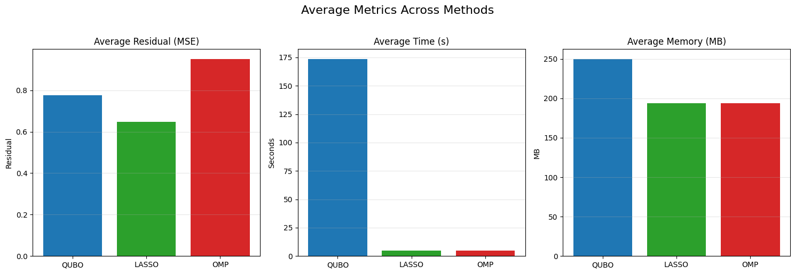

# Sparse Regression with Quantum-Inspired and Classical Methods

This repository contains implementations and comparisons of sparse linear regression techniques, including:

- **LASSO** (Least Absolute Shrinkage and Selection Operator),
- **Orthogonal Matching Pursuit** (OMP),
- **Quantum Annealing** via QUBO formulation using D-Wave's Ocean SDK and QDeep Hybrid Solver.

The project measures accuracy, runtime, and memory consumption across these methods on synthetic datasets.

## Problem Overview

We consider the standard sparse regression model:

$y = X\beta + \varepsilon$

where $X \in \mathbb{R}^{n \times p}$, $y \in \mathbb{R}^n$, and $\beta \in \mathbb{R}^p$ is a sparse vector of unknown coefficients. The goal is to recover $\beta$ from measurements $(X, y)$, assuming only a few non-zero entries in $\beta$.

## Methods

### LASSO

LASSO adds an $\ell_1$-penalty to enforce sparsity:

Implemented using `scikit-learn`'s `Lasso` with adjustable regularization parameter.

### Orthogonal Matching Pursuit (OMP)

OMP is a greedy algorithm that selects features one-by-one based on correlation with the residual. It performs well when features are orthogonal but degrades under strong multicollinearity.

### Quantum Annealing via QUBO

The regression problem is reformulated as a Quadratic Unconstrained Binary Optimization (QUBO) problem. Each coefficient $\beta_j$ is discretized using signed binary encoding:

where $b^+$ and $b^-$ are binary variables representing the positive and negative parts respectively, $\delta$ is the bit resolution, and $K$ is the number of bits per sign.

The resulting binary model is solved using:

- Simulated annealing (`neal.SimulatedAnnealingSampler`)
- Hybrid solvers from the QDeep SDK

In `Math_LASSO_to_QUBO.pdf`, you can find more detailed information on how to formulate the LASSO problem as a QUBO problem.
